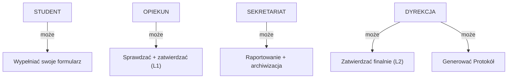

# Aplikacja do Zarządzania Praktykami Zawodowymi Studentów

> **Aplikacja webowa wspierająca pełny cykl zarządzania praktykami zawodowymi studentów** - od planowania, poprzez dokumentację codzienną, po finalne zatwierdzenie.

## 🎯 Cel Projektu

Aplikacja wspiera obsługę praktyk zawodowych w uczelni wyższej z pełnym systemem dokumentacji i zarządzania uprawnieniami dla różnych ról (student, opiekun, sekretariat, dyrekcja).

## 📋 Główne Cechy

✅ **Wszystkie obowiązkowe dokumenty** - 13 załączników  
✅ **System uprawnień (RBAC)** - 4 role z precyzyjną kontrolą dostępu  
✅ **Przepływ zatwierdzania** - Draft → Submitted → Review → Approved  
✅ **Dziennik praktyki** - Codzienne wpisy z trackingiem godzin  
✅ **Efekty nauczania** - Weryfikacja osiągnięć studentów  
✅ **Generowanie PDF** - Automatyczne formaty dokumentów  
✅ **Raporty** - Dla sekretariatu i dyrekcji  
✅ **REST API** - Pełna integracja z frontendem  

---

## 🏗️ Architektura

### Stack Techniczny

```
Backend:    Flask 2.x + SQLAlchemy ORM
Autentykacja: Microsoft OAuth 2.0 (Azure AD)
Baza danych: SQLite (dev) / PostgreSQL (prod)
Frontend:   Jinja2 + Bootstrap 5 + Vanilla JS
PDF:        Flask-WEASYPRINT / WeasyPrint
API:        Flask-RESTX / Blueprints
```

### Struktura Katalogów

```
flask_lab08/
├── app/
│   ├── models/              # Modele bazy danych
│   │   ├── user.py          # User, roles
│   │   ├── internship.py     # Internship, LearningOutcome (NEW)
│   │   └── attachment.py      # Document, DocumentSubmission
│   ├── auth/                # Autentykacja + OAuth
│   ├── student/             # Widoki studenta
│   ├── opiekun/             # Widoki opiekuna
│   ├── admin/               # Widoki dyrekcji
│   └── static/              # CSS, JS, docs
├── docs/                    # Dokumentacja
│   ├── ARCHITECTURE.md      # Ta dokumentacja
│   ├── SYSTEM_UPRAWNIEN.md  # Role-based access control
│   ├── FORMULARZE.md        # Specyfikacja formularzy
│   ├── API.md               # REST API endpoints
│   └── DIAGRAMS.md          # Diagramy Mermaid
└── tests/                   # Testy jednostkowe
```

---

## 📚 Załączniki (Dokumenty)

| # | Nazwa | Typ | Kto | Status |
|---|-------|-----|-----|--------|
| Reg | Regulamin PZ | PDF | - | view-only |
| 1 | Porozumienie | Formularz | Student | ✅ |
| 2 | Program praktyki | Formularz | Student | ✅ |
| 2a | Program i harmonogram | Formularz | Student | ✅ |
| 3 | Karta praktyki | Formularz | Student | ✅ |
| 4 | Potwierdzenie efektów | Formularz | Student | ✅ |
| 4a | Potwierdzenie uzyskania efektów | Auto-raport | System | ✅ |
| 4b | Wniosek o zaliczenie | Formularz | Student | ✅ |
| 5 | Ankieta | Formularz | Student | ⏳ |
| 6 | Dziennik praktyki | Multi-entry | Student | ✅ |
| 7 | Sprawozdanie | Formularz (1 zdanie!) | Student | ✅ |
| 7a | Sprawozdanie niestacjonarne | Formularz | Student | ✅ |
| 8 | Protokół egzaminu | PDF | Dyrekcja | ✅ |
| 9 | Oświadczenie instytucji | Upload | Student | ✅ |

---

## 👥 Role i Uprawnienia

### Student (role="student")
- Wypełnia formularze (załączniki 1-7, 9)
- Przesyła dokumenty
- Wgląd do komentarzy opiekuna
- ❌ Nie widzi Protokołu (załącznik 8)
- ❌ Nie zatwier​dza

### Opiekun (role="opiekun")
- Przegląda dokumenty swoich studentów
- Dodaje komentarze
- Zatwierdza (level 1)
- Generuje raport potwierdzenia efektów
- ❌ Nie generuje Protokołu

### Sekretariat (role="staff")
- Wgląd do wszystkich praktyk
- Raportowanie
- Powiadomienia
- Archiwizacja

### Dyrekcja (role="admin")
- ✅ PEŁNY DOSTĘP
- Zatwierdza finalnie (level 2)
- Generuje Protokół (załącznik 8)
- Zarządzanie użytkownikami
- Raporty

---

## 🚀 Quick Start

### 1. Instalacja

```bash
# Klonuj repozytorium
git clone https://github.com/...

# Stwórz virtual environment
python -m venv venv
source venv/bin/activate  # Windows: venv\Scripts\activate

# Zainstaluj zależności
pip install -r requirements.txt

# Konfiguracja Azure OAuth
export MICROSOFT_CLIENT_ID="..."
export MICROSOFT_CLIENT_SECRET="..."
export MICROSOFT_TENANT_ID="..."
```

### 2. Inicjalizacja bazy danych

```bash
# Utwórz tabele
python
>>> from app import create_app, db
>>> app = create_app()
>>> with app.app_context():
...     db.create_all()
```

### 3. Uruchom aplikację

```bash
python run.py

# Aplikacja dostępna: http://localhost:5000
```

---

## 📖 Dokumentacja

- **[SYSTEM_UPRAWNIEN.md](./SYSTEM_UPRAWNIEN.md)** - Role, macierz uprawnień, RLS
- **[FORMULARZE.md](./FORMULARZE.md)** - Specyfikacja każdego załącznika
- **[API.md](./API.md)** - REST API endpoints
- **[ARCHITECTURE.md](./ARCHITECTURE.md)** - Architektura i przepływy

---

## 🔗 Diagramy

### Hierarchia Uprawnień


### Przepływ Status Dokumentu
```
draft → submitted → pending_review → approved
  ↑                      ↓
  └──────── pending_revision (opiekun ma uwagi)
```

---

## 📱 Interfejs Użytkownika

### Dashboard Studenta
```
┌─────────────────────────────────────┐
│ 👤 Jan Kowalski (Student)            │
├─────────────────────────────────────┤
│ Moje Praktyki                       │
│ └─ TechCorp (43% ukończona)         │
│    ├─ ✅ Porozumienie               │
│    ├─ ✅ Karta praktyki             │
│    ├─ 🔄 Dziennik (18/30 dni)      │
│    ├─ ⏳ Sprawozdanie               │
│    └─ ❌ Protokół (brak dostępu)   │
└─────────────────────────────────────┘
```

### Dashboard Opiekuna
```
┌──────────────────────────────────────┐
│ 👨‍🏫 Prof. Anna Nowak (Opiekun)        │
├──────────────────────────────────────┤
│ Moi Studenci Do Przeglądu (5)        │
│ ├─ Jan Kowalski - Sprawdzanie...    │
│ ├─ Anna Nowak - Czeka na przegląd   │
│ └─ Piotr Lewandowski - Zatwierdzony │
└──────────────────────────────────────┘
```

---

## 🧪 Testowanie

### Uruchom testy
```bash
pytest tests/
pytest tests/test_permissions.py -v
```

### Test Case: Student nie widzi Protokołu
```python
def test_student_cannot_view_protocol():
    client = app.test_client()
    client.post('/auth/login', ...)
    response = client.get('/documents/8')
    assert response.status_code == 403
```

---

## 📊 Schemat Bazy Danych

```sql
-- Główne tabele
users              # Użytkownicy (role: student, opiekun, staff, admin)
internships        # Praktyki
document_submissions  # Przesłane dokumenty
attachments        # Definicje załączników
learning_outcomes  # Efekty nauczania
diary_entries      # Wpisy dziennika praktyki
```

[Szczegółowy schemat](./ARCHITECTURE.md#4-schemat-bazy-danych)

---

## 🔐 Bezpieczeństwo

✅ **HTTPS** w produkcji  
✅ **Autentykacja** Microsoft OAuth 2.0  
✅ **CSRF Protection** w formularzach  
✅ **Row-Level Security** (RLS) - student widzi tylko swoje dane  
✅ **SQL Injection** - ORM (SQLAlchemy)  
✅ **Audyt** - logging wszystkich akcji  

---

## 📈 Roadmap

### FAZA 1: Modele (Tydzień 1)
- [x] User model + roles
- [ ] Internship, LearningOutcome models
- [ ] DiaryEntry model
- [ ] Migracje bazy danych

### FAZA 2: Formularze (Tydzień 1-2)
- [ ] Porozumienie (załącznik 1)
- [ ] Karta praktyki (załącznik 3)
- [ ] Dziennik (załącznik 6)
- [ ] Sprawozdanie (załącznik 7) - walidacja 1 zdania!

### FAZA 3: System Uprawnień (Tydzień 2)
- [ ] Decoratory RBAC
- [ ] Row-level security
- [ ] Workflow zatwierdzania

### FAZA 4: Interfejs (Tydzień 2-3)
- [ ] Dashboard studenta
- [ ] Dashboard opiekuna
- [ ] Dashboard dyrekcji
- [ ] Podgląd PDF

### FAZA 5: REST API (Tydzień 3-4)
- [ ] GET /api/internships
- [ ] POST /api/documents
- [ ] PATCH /api/documents/{id}/approve
- [ ] Dokumentacja Swagger

---

## 🤝 Współpraca

Wkład w projekt jest mile widziany!

1. Fork repozytorium
2. Utwórz branch (`git checkout -b feature/nova-funkcja`)
3. Commituj zmiany (`git commit -m 'Dodaj nową funkcję'`)
4. Push do branch (`git push origin feature/nova-funkcja`)
5. Otwórz Pull Request

---

## 📝 Licencja

Projekt udostępniony na licencji MIT.

---

## 📧 Kontakt

- **Prowadzący**: Prof. Anna Nowak
- **Email**: anna.nowak@uczelnia.pl
- **Issues**: [GitHub Issues](https://github.com/.../issues)

---

## 📚 Dodatkowe Zasoby

- [Dokumentacja Flask](https://flask.palletsprojects.com/)
- [SQLAlchemy ORM](https://docs.sqlalchemy.org/)
- [Bootstrap 5](https://getbootstrap.com/)
- [Mermaid Diagrams](https://mermaid.live)
- [Microsoft OAuth 2.0](https://docs.microsoft.com/en-us/azure/active-directory/)

---

**Ostatnia aktualizacja**: 2026-05-24  
**Wersja**: 1.0  
**Status**: 🟡 W trakcie implementacji
